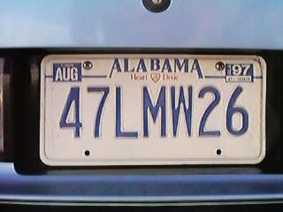

## Edge detection with CV2 

This assignment deals with edge detection of pictures containing text. The script can both detect edges on the original image We_Hold_These_Truths_at_Jefferson_Memorial used in the assignment as well as other image datasets. 

### Data:
In the script, you can use the original image or the data set from Kaggle containing car license plates (can be found here https://www.kaggle.com/mobassir/fifty-states-car-license-plates-dataset).

Below is the image of Jefferson Memorial and afterwards, an example of a car license plate picture is given: 




The picture We_Hold_These_Truths_at_Jefferson_Memorial.JPG is in the repository. However, cefore you can access the car license data, you will need to create a kaggle API following the instructions here [https://github.com/Kaggle/kaggle-api#:~:text=To%20use%20the%20Kaggle%20API,file%20containing%20your%20API%20credentials]. When you have created an API and have a kaggle.json file, upload the file to worker02 if you are working there and move to the place the .json file is saved. When you are there you can execute the commands below:

```
mkdir ~/.kaggle/ # New folder 
mv kaggle.json ~/.kaggle/ # Move kaggle.json to this folder - required to activate api
```

Now you can download the data directly from your terminal by moving to the folder containing my repository and download the data by typing:

```
# When you are at the 'start' of my repository (i.e. cds-visual-exam) you can type

cd data/3 # Changing directory to the place the data should be saved.

kaggle datasets download -d  mobassir/fifty-states-car-license-plates-dataset # Download data

unzip fifty-states-car-license-plates-dataset.zip # Unzip data
```

### Commandline arguments:

- "--data_folder", help = "str of data_folder, default is ../../data/1"

- "--output_folder", help = "str of output folder, default is ../../out/1") 

- "--condition", help = "REQUIRED - Condition - 'Memorial' for single image of Jefferson Memorial or 'Cars' for multiple car license plate pictures")

```
cd src/1

python3 edge_detection.py -condition 'Cars'

python3 edge_detection.py -condition 'Memorial'

```

### Preprocessing: 
A couple of preprocessing steps are needed to achieve an edge detected image. This involves cropping, conversion to greyscale and blurring. To crop the image, I used the dimensions of the images to take 0.5*1/6 as minimum value and 5.5*1/6 as the max value of the width. I used the same approach with height and this resulted in an image containing almost exclusively text. The color-space of image was converted to greyscale with cvtColor and the colorspace COLOR_BGR2GRAY. The images were blurred to reduce noice using a Gaussian filter with a kernel size of 5x5. 

After these steps, I used Canny detection to find edges where minimum and maximum values were found automatically using numPy based on the distribution of pixel values in the picture. Min value were defined as the 5% lower percentile of the pixel values and max was defined as the 95% percentile. 

### Results and discussion:
All results from this assignment are found in ```out/1```

Below are a couple of results of the edge detection:


The choice of an automatic threshold in the canny edge detection had the consequence that some edges and text in some licenses were not captured (see e.g. the Georgia or Illinois license). Also, the cropping was done in a manual way in order to split up steps and demonstrate both the conversion to greyscale, blurring and edge detection. Also, the formats of We_Hold_These_Truths_at_Jefferson_Memorial_ and the car license plates respectively, had two very different dimensions and needed different cropping. Hovewer, if the script was to be further developed, it would be beneficial to find ways to crop images more automatically so it would not need modifications when introduced to new images.  
