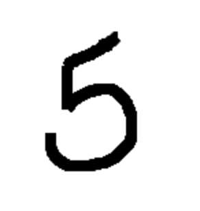

## Classifier benchmarks using Logistic Regression and a Neural Network

In this assignment, I will create two command-line tools which can be used to perform a simple classification task on the MNIST data and print the output to the terminal. These scripts can then be used to provide easy-to-understand benchmark scores for evaluating these models.

One python script takes the full MNIST data set, trains a Logistic Regression Classifier, and prints the evaluation metrics to the terminal.The other python script takes the full MNIST dataset, trains a neural network classifier, and prints the evaluation metrics to the terminal.

In both scripts, it is possible to save the trained model and test the model on your own 'handwritten' digit image. You can draw one online here https://drawisland.com/. I have provided a default image shown below: 

 

### Data: 
In this script, you will not need to download any data as it is automatically downloaded through the fetch_openml() function.


### Commandline arguments:

#### Logistic Regression script:

‘--test_split_value’, help = "Test size of dataset"
 
‘--tolerance’, help='Penalty in Logistic Regression - default is 0.1'

'--solver', help='Solver in Logistic Regression - default is saga') 

'--saving_mode', help = "Location where the model should be saved (path/to/saved/model)"

'--predict_mode', help='Predict unseen photo (Yes) or dont (No)')

'--new_image',  help = "Path location of new, unseen image that the model should predict"

'--output_path', help = "Path location of classification report") 


#### Neural Network script:

‘--test_split_value’, help = "Test size of dataset"

'--layer_values', help = "Hidden layers and their values in the NN classifier"

'--epochs', help = "Number of epochs to train the NN classifier over"

'--model_path', help = "Path location to save trained numpy model"

'--predict_mode', help='Predict unseen photo (Yes) or dont (No)'

'--new_image', help = "Path location of new, unseen image that the model should predict"

'--output_path' help = "Path location of classification report"


Below is an example of how to move and execute the scripts from the commandline:
```
cd src/2 # Move to the folder containing the scripts

python3 lr_mnist.py # Execute the script running the logistic regression

python3 nn_mnist.py # Execute the script running the neural network
```

### Preprocessing: 

In both scripts the data was imported through fetch_openml whereafter they were split into X and y-values, min-max normalized and binarized with LabelBinarizer(). Afterwards the classifier was defined and fit to the data and from these results, a classification report was produced. The models can be saved using pickle in the logistic regression and numpy.save in the neural network. To predict a new picture, it is loaded into the script and turned into greyscale whereafter we use the trained model to predict its class. This prediction is printed in the terminal. 
  

### Results and discussion

All results from this assignment are found in ```out/2```

The two scripts yield different results. In the table below you can see F1-score of each digit:


| Digit    | F1-score (LR / NN) |
| --------- | --------|
| 1    | 0.96 % / 97 %       |
| 2 | 96 % / 98 %        |
| 3 | 90 % / 95 %        |
| 4 | 90 % / 95 %        |
| 5 | 93 % / 95 %        |
| 6 | 88 % / 95 %        |
| 7 | 95 % / 97 %        |
| 8 | 93 % / 95 %        |
| 9 | 93 % / 95 %        |
| 10 | 89 % / 93 %        |

From these results it seems like the Neural Network slightly outperforms the Logistic regression, however both classifiers reach fairly high f-scores. LR have more difficulty classifying 6 and 10 while the NN also reaches its lowest f-score with 10. Moreover, they both predict the unseen image correctly as a 5. One element to reflect upon is that min-max normalization is performed before the dataset is split into train and test set. This can have had the effect that there is already information and a range of values in the test set that the model has learned about leading to a slight amount of overfitting.
