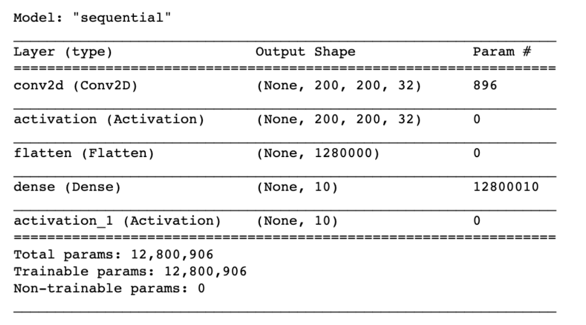
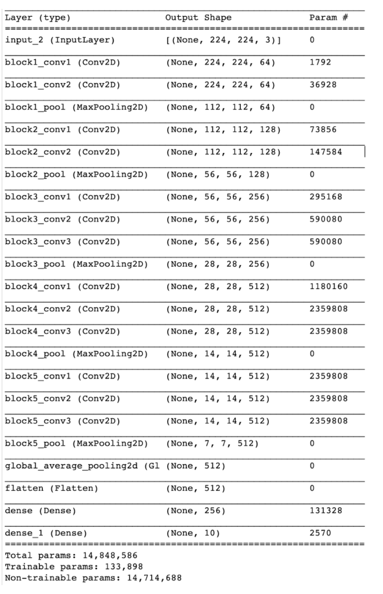
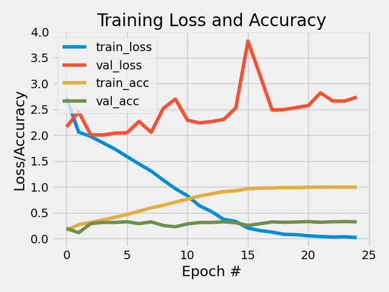
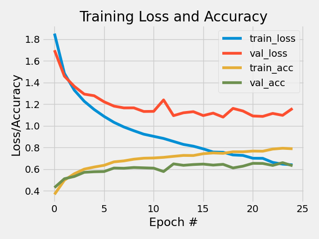

This project deals with a multi-class classification of impressionist painters. It further attempts to test a Convolutional Neural Network (CNN) that has not been pretrained against one that has (VGG16)

Data:

Before you can access the data, you will need to create a kaggle API following the instructions here [https://github.com/Kaggle/kaggle-api#:~:text=To%20use%20the%20Kaggle%20API,file%20containing%20your%20API%20credentials]. When you have created an API and have a kaggle.json file, upload the file to worker02 if you are working there and move to the place the .json file is saved. When you are there you can execute the commands below:

```
mkdir ~/.kaggle/ # New folder 
mv kaggle.json ~/.kaggle/ # Move kaggle.json to this folder - required to activate api
```
Now you can download the data directly from your terminal by moving to the folder containing my repository and download the data by typing:

```
# When you are at the 'start' of my repository (i.e. cds-visual-exam) you can type

cd data/3 # Changing directory to the place the data should be saved.

kaggle datasets download -d  delayedkarma/impressionist-classifier-data # Download data

unzip impressionist-classifier-data.zip # Unzip data
```
N.B.: If you do not download the data at this location, please change the input paths (--train and --validation) in the commandline arguments so that the script knows where to find the input data.


Commandline arguments: 

'--classifier', help='REQUIRED - str, type of classifier used - either non-pretrained or pretrained'

'--train',  help='str, path for training data'

'--validation', help='str, path for validation data'
 
'--outpath',  help='str, path for output data'
 
'--resize',  help='int resize value of paintings'

'--epochs', help = 'number of epochs the model should run'

'--batches',  help = 'Number of batches to group dataset into'

To run the scripts please type:
```
cd src/3

python3 cnn_artists.py -classifier 'non-pretrained'

python3 cnn_artists.py -classifier 'pretrained'
```

Preprocessing:
Within the script, one can choose between the two classifiers and these have slightly different preprocessing steps.

In the non-pretrained CNN, every image is resized and saved as an array inside a list and the label belonging to each image is also saved in another array. As the data is already divided into test/train splits, it is not done so in the script and the user cannot determine train and test sizes. Afterwards, all label values are subject to a one-hot encoding - here, the labels are transformed into vectors of 0 and 1, where the position of 1 indicates what the label is; for example, 0,1,0,0,0,0,0,0,0,0 could signify that the artist was Picasso and 0,0,0,0,0,0,0,0,0,1 could mean that it was VanGogh. As neural networks are trained faster when the data is normalized to a value between 0 and 1, all input pictures are divided with 255 as this is the maximum value a pixel can have. This is both in the non-pretrained and the VGG16 classifiers. Afterwards, the CNN structure, its input layer, hidden layers and output layers as well as activation functions were defined. Below is an image of the model architecture: 

<p align="center">
  <a href="https://github.com/marmor97/cds-visual-exam">
    
  </a>

As the pre-trained classifier uses a different input format and does not take arrays of images, the data is loaded using the function image_dataset_from_directory from keras where multiple parameters are defined and the dataset is loaded as a BatchDataset. Here, the target size is also defined as 224x224 as this is what VGG16 is trained on. We also define a batch size of 128. This means that the data is grouped into batches leading to a faster process of model fitting. As mentioned above, values were also normalized. Afterwards, the VGG16 model is instantiated and loaded. We apply some different changes to the model: we define that it should not include the top layers so we can train our own, we define an 'average' pooling layer and we say that every layer in the model can not be retrained. Before we compile the model, we set the architecture of the last part of the model. This final architecture includes a flattening layer, a fully-connected layer and an output layer with a 'rectified linear unit' (relu) and a 'softmax' activation function, respectively. Below is a summary of the model architecture:

<p align="center">
  <a href="https://github.com/marmor97/cds-visual-exam">
    
  </a>
    


Results:
All results from this assignment are found in ```out/3```

To compare performance, f1-scores are extracted from both models and can be seen below:

| Artist    | F1-score (CNN / VGG16) |
| --------- | --------|
| Renoir    | 27 % / 62 %       |
| Matisse | 30 % / 69 %        |
| Pissarro | 31 % / 63 %        |
| Hassam | 37 % / 57 %        |
| VanGogh | 36 % / 66 %        |
| Sargent | 45 % / 50 %        |
| Degas | 45 % / 47 %        |
| Monet| 40 % / 72 %        |
| Gauguin | 43 % / 67 %        |
| Cezanne | 35 % / 67 %        |

These scores make it quite difficult to answer which model is best. While VGG16 is good in some cases, for example Matisse, Hassam, Van Gogh, Monet, and Cezanne, the CNN has substantially higher performance in other cases. 

Also, learning curves were saved and can be seen here:

<p align="center">
  <a href="https://github.com/marmor97/cds-visual-exam">
    
  </a>
    
<p align="center">
  <a href="https://github.com/marmor97/cds-visual-exam">
    
  </a>
    
When looking at the f-scores above we see a substantial difference between the CNN that is not pre-trained (upper figure) and the VGG16 model (lower figure). In many cases, the accuracy is almost double as high , for example when classifying Matisse, Monet and Cezanne. In single cases, the two models have similar performance such as with Degas and Sargent.

The VGG16, however, seems to slightly overfit the data when looking at the learning curves above. 
The loss curves are moving in diverging directions from the point of four epochs. The accuracies separate to a lesser extent and and follow more steadily to reach between 65 % and 80 % accuracy. Overfitting is also the case is different for the non-pretrained model. We see that both losses and accuracies reach a point of inflection before reaching five epochs. Furthermore, the validation loss has noisy movements in both models which could suggest that the validation set is too small or unrepresentative. These observations might indicate that the VGG16 model has the best potential to generalize of the two models considering the higher accuracies and that it is less overfit than the CNN.  

If the script were to be further developed, it would be interesting to try parameter tuning of epochs, optimizers and pooling methods to see how good the models would perform if the optimal parameters had been found.

