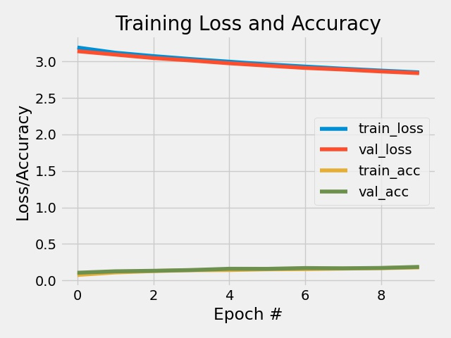
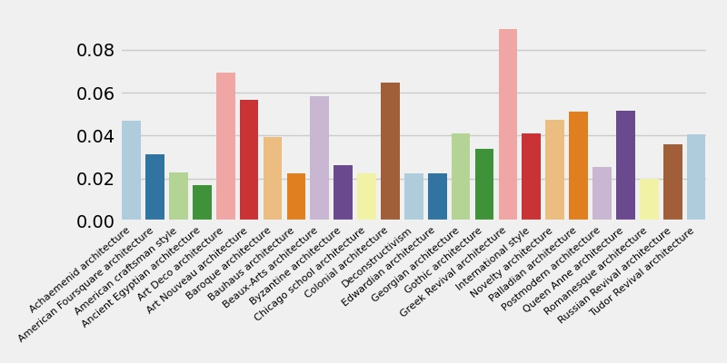
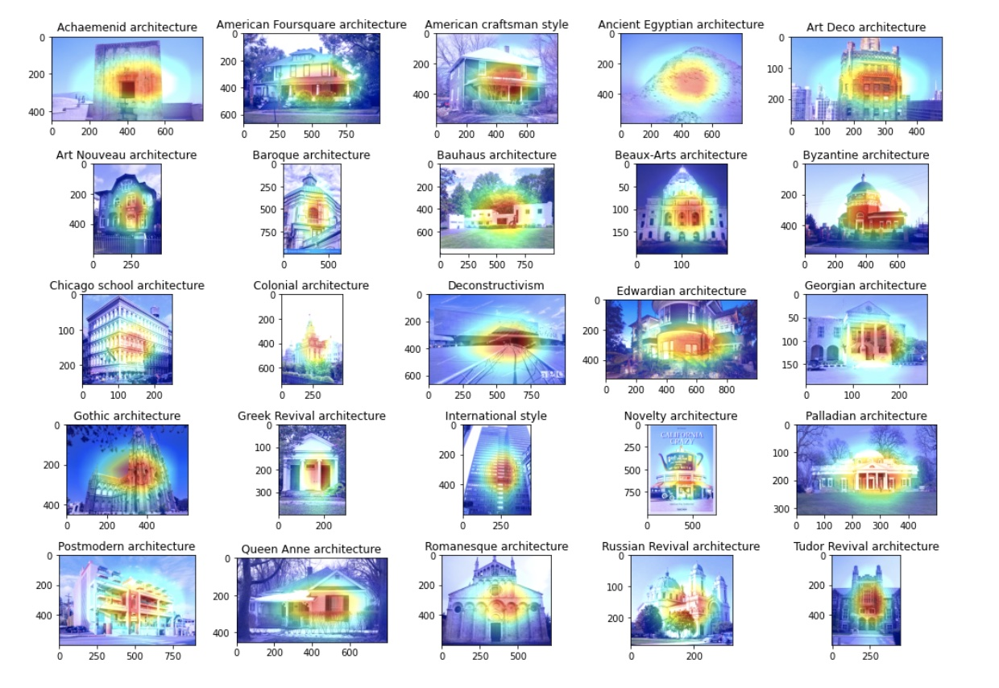

## Classifying architectural styles

This project attempts to classify 25 different architectural styles using the pretrained resnet50 model combined with final layers defined by me. It builds upon the work in "Architectural Style Classification using Multinomial Latent Logistic Regression" (Xu, Tao, Zhang, Wu, & Tsoi, 2014). They build a Logistic Regression Classifier reaching nearly 70% accuracy. The dataset was made by https://www.kaggle.com/wwymak/architecture-dataset. It features 25 different architectural styles with in total 10113 images. Additionally, the project attempts to produce feature heatmaps of samples from each style. Lastly, it tries to make it possible to upload ones own images and see which style has the strongest association with it.

### Data:

Before you can access the data, you will need to create a kaggle API following the instructions here [https://github.com/Kaggle/kaggle-api#:~:text=To%20use%20the%20Kaggle%20API,file%20containing%20your%20API%20credentials]. When you have created an API and have a kaggle.json file, upload the file to worker02 if you are working there and move to the place the .json file is saved. When you are there you can execute the commands below:

```
mkdir ~/.kaggle/ # New folder 
mv kaggle.json ~/.kaggle/ # Move kaggle.json to this folder - required to activate api
```
Now you can download the data directly from your terminal by moving to the folder containing my repository and download the data by typing:

```
# When you are at the 'start' of my repository (i.e. cds-visual-exam) you can type

cd data/3 # Changing directory to the place the data should be saved.

kaggle datasets download -d wwymak/architecture-dataset # Download data

unzip architectural-styles-dataset.zip # Unzip data
```
N.B.: If you do not download the data at this location, please change the input path in the commandline arguments.


### Commandline arguments:
"--outpath", help = "Path where plots, figures and heatmaps are saved"

"--path", help = "path to folder containing train and validation images - default is architectural-styles-dataset"

"--epochs", help = "Number of epochs - default is 50"

"--unseen_image_path", help = "Path to unseen image that should be predicted - default is unseen_img.jpg"

To run the script please type:

```
cd src/4

python3 architectural_patterns.py

```

N.B.: If you experience problems with tensorflow and keras and get this error ```module 'tensorflow.python.keras.utils.generic_utils' has no attribute 'populate_dict_with_module_objects'``` try writing these commands in the terminal:

```
source cv101_marie/bin/activate # Activate environment
pip list | grep tf # Uninstall tf_nightly 
pip install tensorflow --upgrade --force-reinstall # Force reinstall tensorflow

``` 

### Preprocessing:

As the data is organized in such a way that every subfolder of "architectural-styles-dataset" is a style, we can use Keras preprocessing.image_dataset_from_directory() function to load train and validation sets. Within this function, we allocate 80 % of the data to the train and 20 % to validation. Afterwards, data is sent through the same preprocessing steps as data used in ResNet50; this includes converting every image from RGB to BGR and zero-centering them with respect to the ImageNet dataset. Afterwards, the ResNet50 model is loaded through keras.applications, where I chose the pooling method to be 'average pooling' and input shape as 224x224 and decided that all layers except those defined by me cannot be trained. As the name indicates, ResNet50 contains in total 50 layers. The last classifier layers are defined manually where the structure is flattening layer --> fully-connected with 256 neurons and ReLU --> fully-connected with 64 and ReLU --> output layer with softmax activation. It is compiled with Adam optimizer and a learning rate of 0.0001.

The model is fit with 20 epochs and batches of 128. Predictions are gathered based on the validation data. To see the predicted style of an unseen image, the image is loaded with Keras preprocessing.image.load_img(), where the target size is 224x224 corresponding to the size when it was trained. Afterwards it is normalized and transformed to a numpy array and lastly, a tensor. The predictions are saved in a plot made with seaborn in the output/4 folder.

To generate the heatmaps projected onto the original images, the method – Gradient-weighted Class Activation Mapping (Grad-CAM) is used. This takes the last convolutional layer and the strongest predicted class and uses the gradients of the picture in this layer to see which areas are highlighted and informative in the specific case (Selvaraju, Cogswell, Das, Vedantam, Parikh,& Batra, 2017). In my project, I am sampling one image from each class, to see whether there are clear and different patterns across architectural styles. By looping through each sub-folder of "architectural-styles-dataset", a picture can be randomly sampled from each style. This picture is preprocessed in the same way as the unseen picture mentioned above, and afterwards the gradient and its intensities are collected and transformed into a heatmap. This map is resized to the dimensions of the original picture, 'un-normalized' by multiplying with 255 and added to the original image. These pictures are afterwards saved in a grid made with matplotlib in the output folder. 


### Results:

With this model, we see accuracies reaching 18.35 % at the 10th epoch. This is far from the results gathered in the original paper. When not thinking of the original paper, one could say that 18.35 % is quite good considering that there are 25 classes. On the other hand, when we use a pretrained model, we could maybe expect a little more. Despite these results, we see that it is not overfitting, and has decent loss and accuracy curves. If scope and time allowed it, the model should run for more epochs to see its full potential. Another implementation could be to expand the top layer. Currently, there are not many top layers in the network, and as the pre-trained layers can be considered more like feature extraction, the network could benefit from more layer allowing it to learn more patterns faster.


The barplot above displays the predicted probabilities of the new image. They are very low (few reach even five percent) and reflect that the model is lacking training time. The highest predicted class is Greek Revival Architecture which is not representative as the Guggenheim Museum is Deconstructivism. It would be interesting to see how probabilities changed with more training time.

<p align="left">
    
  <p>

<p align="left">
    
  <p>


In the collection of heatmaps seen below, there are a couple of things to highlight. In most instances, the important features are somewhere on the building; sometimes it is a rather large part of the building (e.g. Byzantine architecture) compared to other times (e.g. International style). One could argue that the features that are highlighted, differ across styles. In Deconstructivism and Georgian Architecture, the entrance seems to be a quite informative feature whereas more emphasis is placed on the middle areas of the buildings in Art Deco architecture and International style. However, it is limited how much one can 'trust' these maps, when accuries are not higher. One can also question the representativity of the maps, when they are made on single images from each style. This problem could maybe be solved by taking the mean values of heatmaps of all pictures within one style - but it is difficult to choose which image to superimpose it with then.

<p align="left">
    
  <p>

In the collection of heatmaps seen below, there are a couple of things to highlight. In most instances, the important features are somewhere on the building; sometimes it is a rather large part of the building (e.g. Byzantine architecture) compared to other cases (e.g. International style). One could argue that the features that are highlighted, differ across styles. In Deconstructivism and Georgian Architecture, the entrance seems to be a quite informative feature whereas more emphasis is placed on the middle areas of the buildings in Art Deco architecture and International style. However, it is limited how much one can 'trust' these maps, when accuries are not higher. One can also question the representativity of the maps, when they are made on single images from each style. This problem could maybe be solved by taking the mean values of heatmaps of all pictures within one style - but it is difficult to choose which image to superimpose it with then. In summary, the model is not very useful or applicable at the moment but has potential if it is dealt with in depth.


#### References:
Xu, Z., Tao, D., Zhang, Y., Wu, J., & Tsoi, A. C. (2014, September). Architectural style classification using multinomial latent logistic regression. In European Conference on Computer Vision (pp. 600-615). Springer, Cham.

Selvaraju, R. R., Cogswell, M., Das, A., Vedantam, R., Parikh, D., & Batra, D. (2017). Grad-cam: Visual explanations from deep networks via gradient-based localization. In Proceedings of the IEEE international conference on computer vision (pp. 618-626).

pip3 install --upgrade tensorflow
tensorflow version er 2.4.1